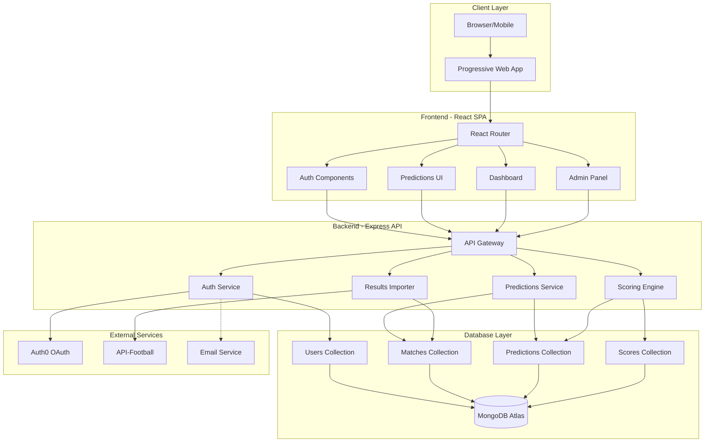
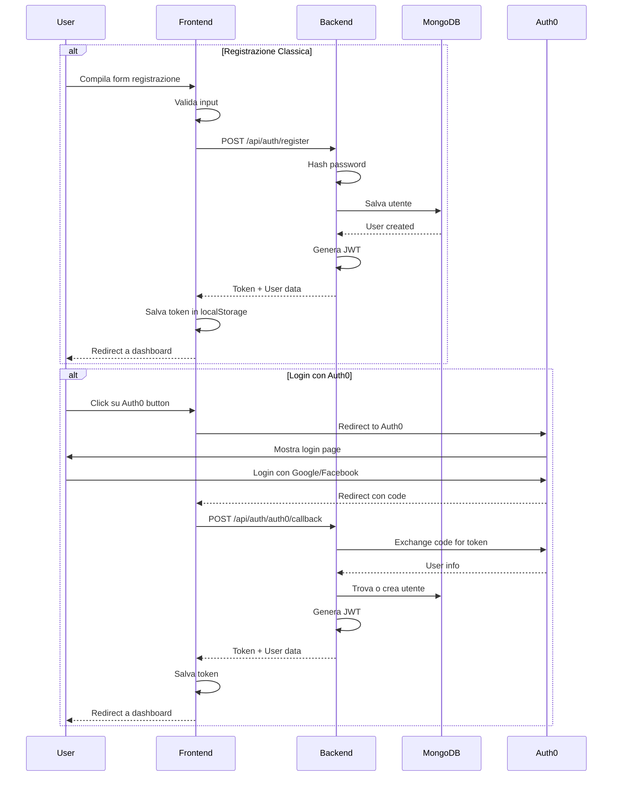
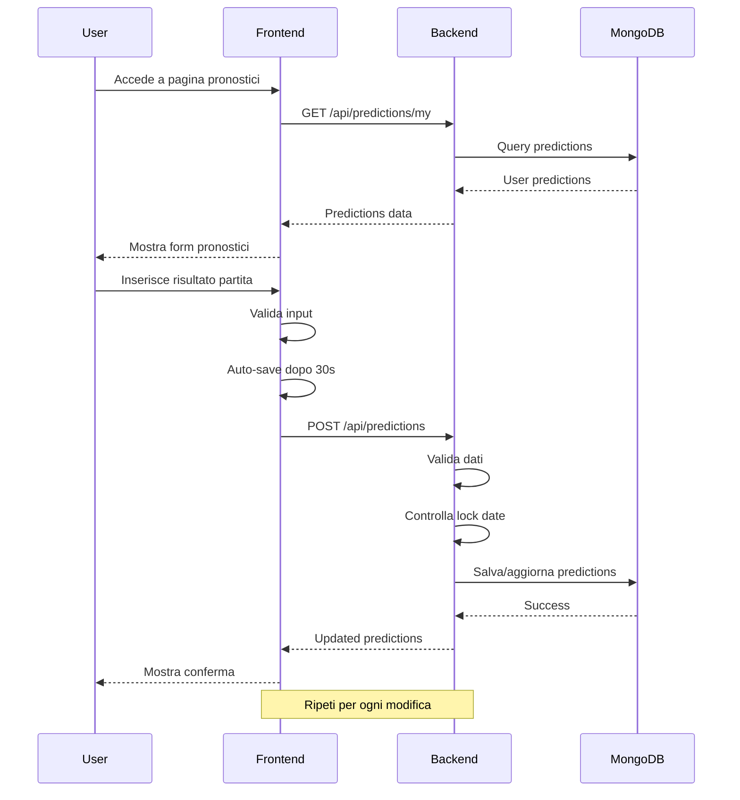
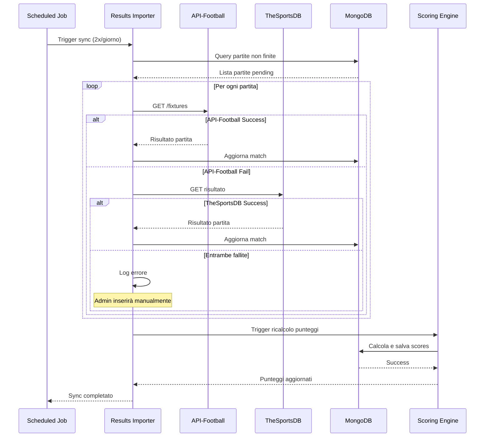
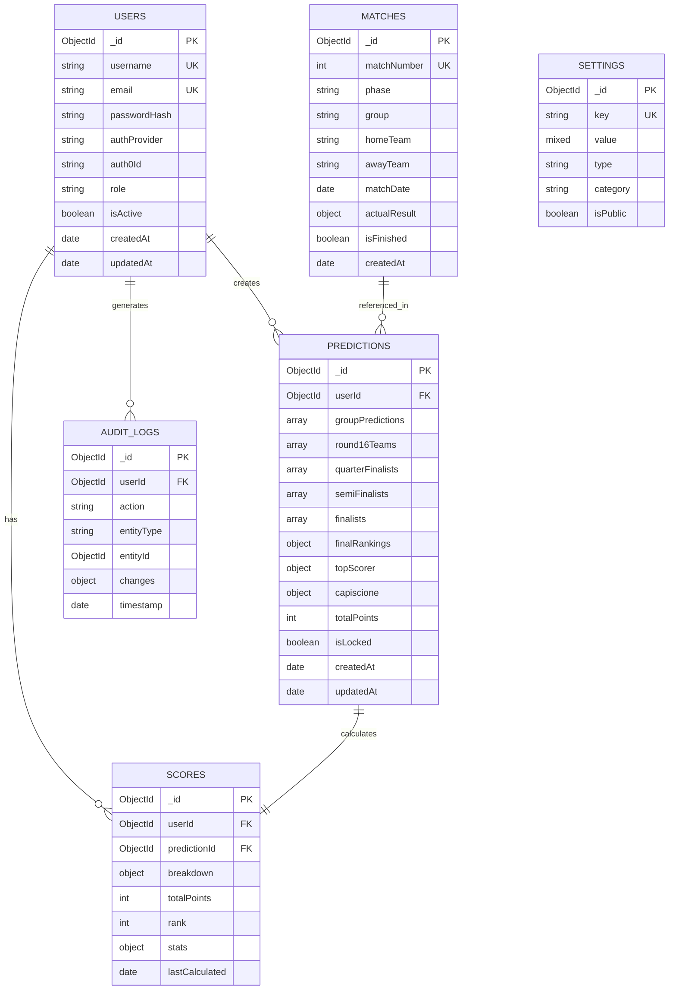
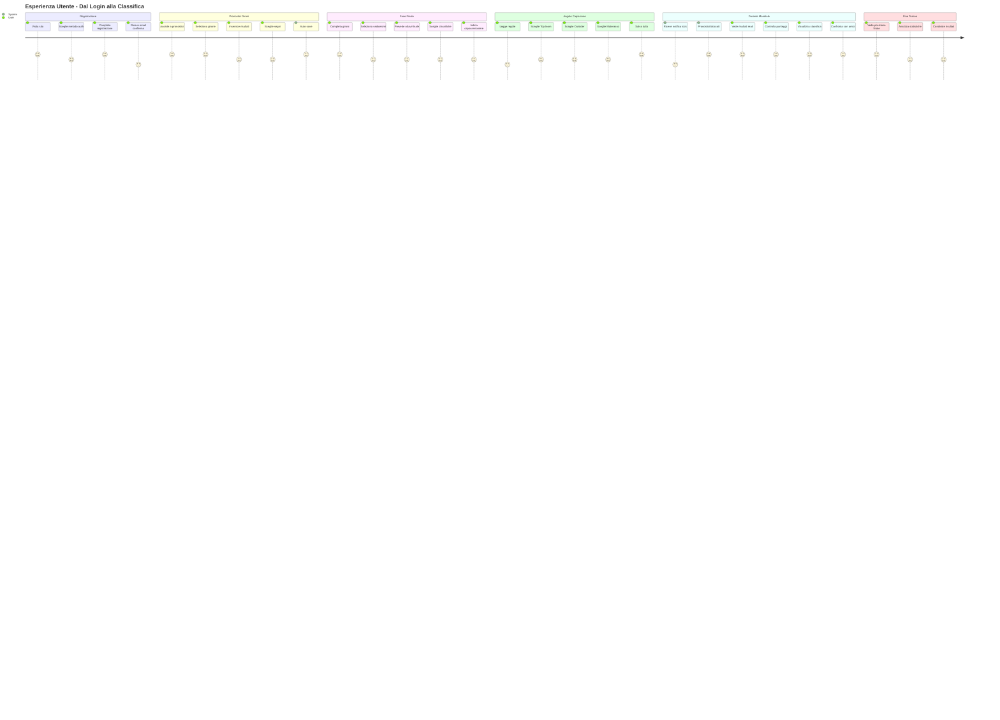
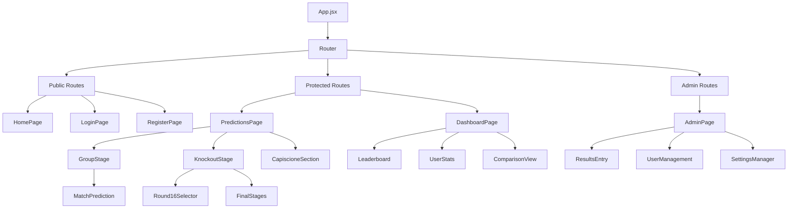
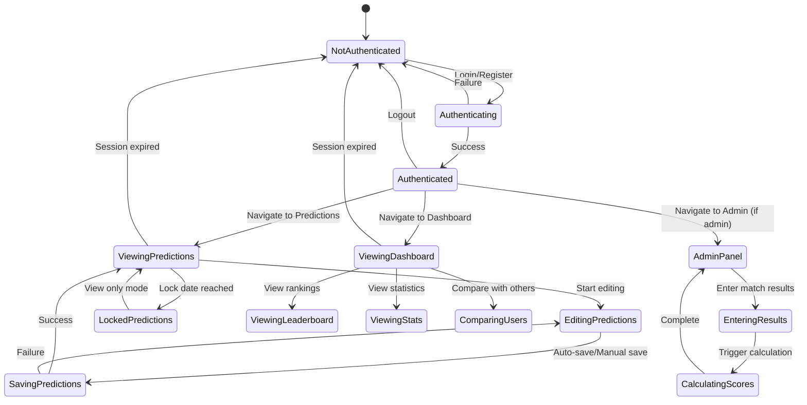
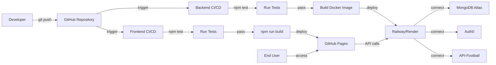

# Diagrammi Architetturali - FIFA 2026 Predictions App

## 1. Architettura Sistema Completa

## 2. Flusso Autenticazione

## 3. Flusso Inserimento Pronostici

## 4. Flusso Calcolo Punteggi

```mermaid
flowchart TD
    Start([Admin inserisce risultato]) --> UpdateMatch[Aggiorna Match in DB]
    UpdateMatch --> TriggerCalc[Trigger calcolo punteggi]
    
    TriggerCalc --> GetPreds[Ottieni tutte le predictions]
    GetPreds --> LoopPreds{Per ogni prediction}
    
    LoopPreds --> CalcGroup[Calcola punti gironi]
    CalcGroup --> CheckExact{Risultato esatto?}
    CheckExact -->|Si| Add6[+6 punti]
    CheckExact -->|No| CheckSign{Segno corretto?}
    CheckSign -->|Si| Add3[+3 punti]
    CheckSign -->|No| Add0[+0 punti]
    
    Add6 --> CountExact[Conta risultati esatti]
    Add3 --> CountExact
    Add0 --> CountExact
    
    CountExact --> CheckBonus{Multiplo di 5?}
    CheckBonus -->|Si| AddBonus[+5 punti bonus]
    CheckBonus -->|No| CalcKnockout
    AddBonus --> CalcKnockout[Calcola punti fase finale]
    
    CalcKnockout --> CalcRound16[Sedicesimi: 20pt + 5pt posizione]
    CalcRound16 --> CalcQuarter[Ottavi: 20pt per squadra]
    CalcQuarter --> CalcSemi[Quarti: 30pt per squadra]
    CalcSemi --> CalcFinal[Semi: 50pt, Finale: 60pt]
    
    CalcFinal --> CalcRankings[Calcola classifiche finali]
    CalcRankings --> Winner[1°: 80pt, 2°: 50pt]
    Winner --> ThirdFourth[3°: 25pt, 4°: 25pt]
    ThirdFourth --> TopScorer[Capocannoniere: 30pt]
    
    TopScorer --> CalcCapiscione[Calcola Angolo Capiscione]
    CalcCapiscione --> TopTeam[Top: 25pt]
    TopTeam --> OutsiderTeam[Outsider: 20pt]
    OutsiderTeam --> MaterassoTeam[Materasso: 15pt]
    
    MaterassoTeam --> SumTotal[Somma totale punti]
    SumTotal --> SaveScore[Salva in Scores collection]
    SaveScore --> MorePreds{Altre predictions?}
    
    MorePreds -->|Si| LoopPreds
    MorePreds -->|No| UpdateRanks[Aggiorna classifiche]
    UpdateRanks --> End([Fine])
```

## 5. Flusso Import Risultati Automatico

## 6. Struttura Database

## 7. Flusso Utente Completo

## 8. Componenti Frontend

## 9. Stati Applicazione

## 10. Deployment Pipeline

## Note sui Diagrammi

Questi diagrammi forniscono una visione completa dell'architettura e dei flussi dell'applicazione. Sono stati creati usando Mermaid per essere facilmente modificabili e versionabili insieme al codice.

Per visualizzare i diagrammi:
1. Usa un editor Markdown con supporto Mermaid (VS Code con estensione)
2. Visualizza su GitHub (supporto nativo)
3. Usa Mermaid Live Editor: https://mermaid.live/